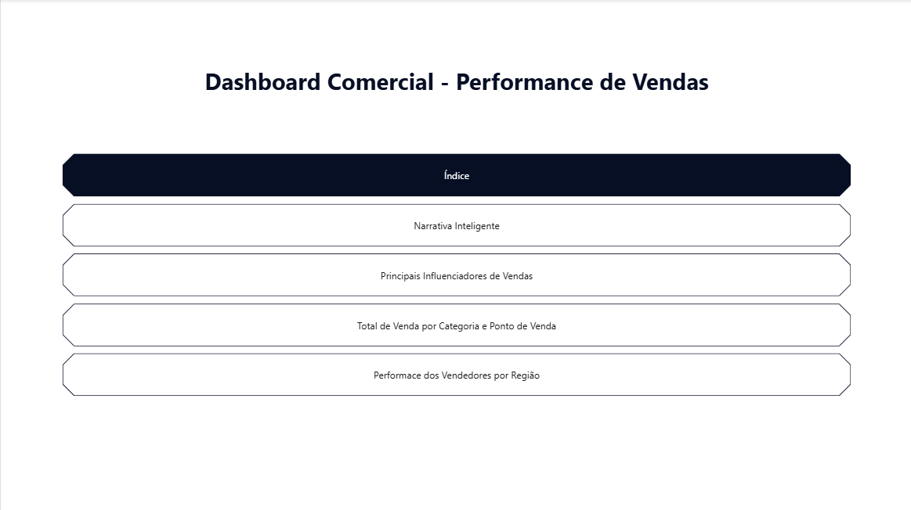
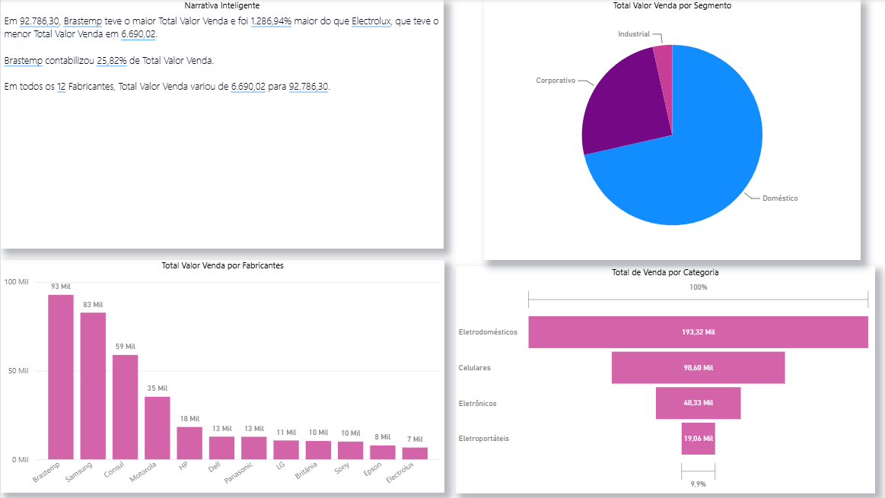
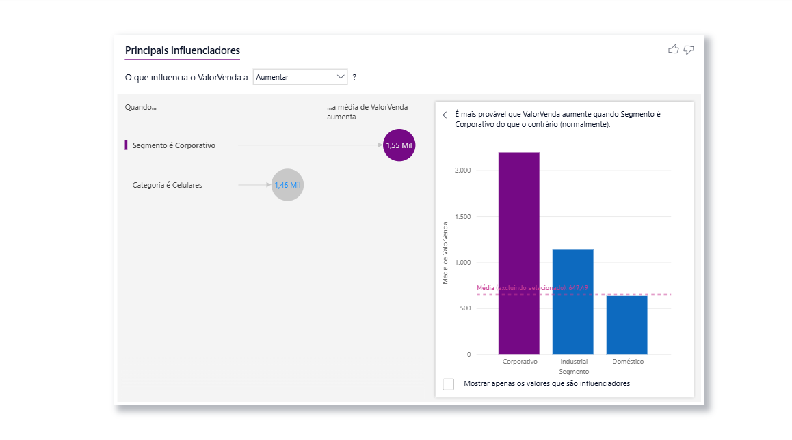
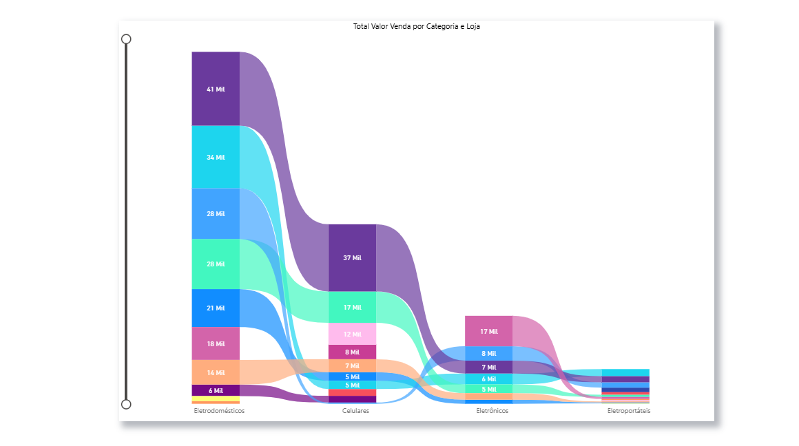
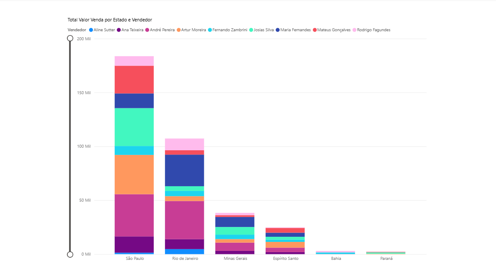

#  Power BI Sales Dashboard

An interactive sales dashboard built with **Microsoft Power BI** to analyze business performance through dynamic visualizations and data-driven insights.

---

##  About the Project

This project was developed using **Microsoft Power BI** to transform raw sales data into meaningful business insights.

The dashboard provides an intuitive and interactive experience, allowing users to analyze sales performance, identify key factors influencing results, compare categories, evaluate regional performance, and support strategic decision-making.

---

##  Technologies Used

- Microsoft Power BI Desktop
- Power Query (ETL)
- DAX (Data Analysis Expressions)
- Data Modeling
- Business Intelligence (BI)

---

##  Dashboard Pages

### 🏠 Index

Navigation page providing quick access to all reports.



---

###  Smart Narrative

Automatically generated summary highlighting the main sales insights and KPIs.



---

###  Key Influencers

AI-powered visual that identifies the factors with the greatest impact on sales performance.



---

###  Total Sales by Category

Ribbon chart comparing total sales across product categories and points of sale.



---

###  Salesperson Performance by Region

Analysis of salesperson performance across different regions.



---

##  Dashboard Features

- Interactive Navigation
- Smart Narrative
- Key Influencers (Artificial Intelligence)
- Ribbon Chart
- Pie Chart
- Funnel Chart
- Column Charts
- Dynamic Filters (Slicers)
- KPI Visualization
- Interactive Reports

---

##  Skills Demonstrated

- Business Intelligence
- Data Visualization
- Dashboard Design
- Data Modeling
- Power Query
- DAX
- ETL Process
- KPI Analysis
- Storytelling with Data

---

## 📷 Dashboard Preview

| Index | Smart Narrative |
|:------:|:---------------:|
|  |  |

| Key Influencers | Total Sales by Category |
|:---------------:|:-----------------------:|
|  |  |

| Salesperson Performance by Region |
|:---------------------------------:|
|  |

---

##  Repository Structure

```text
powerbi-sales-dashboard/
│
├── images/
│   ├── indice.png
│   ├── narrativainteligente.png
│   ├── principaisinfluenciadores.png
│   ├── totaldevendaporcategoria.png
│   └── performancevendedoresregiao.png
│
├── powerbi-sales-dashboard.pbix
└── README.md
```

---

##  Project Objectives

- Transform sales data into meaningful insights.
- Demonstrate Business Intelligence techniques.
- Build an interactive and user-friendly dashboard.
- Apply Power BI best practices.
- Support data-driven decision-making.

---
Information Systems Student | Power BI | SQL | Python | Data Analysis

[](https://www.linkedin.com/in/thaissa-gonçalves-de-souza-1b8625303)

[](https://github.com/thaissagoncalves1)
